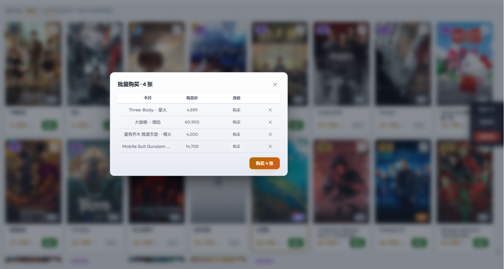
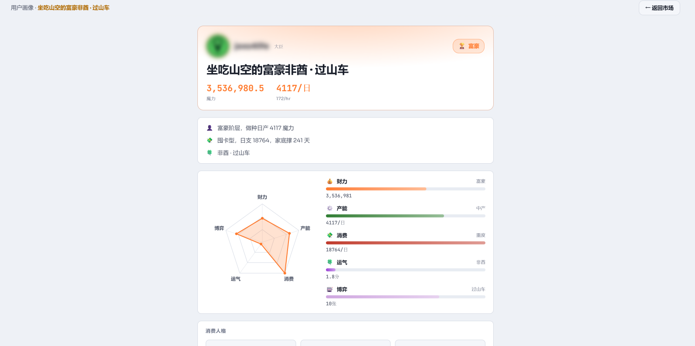

<div align="center">


# MCard

**M-Team Card Market Manual Tool** · Chrome MV3 Extension

[](https://github.com/jaxo4life/mtcard/releases)
[](https://developer.chrome.com/docs/extensions/mv3/intro/)
[](https://developer.chrome.com/docs/extensions/mv3/intro/)

🎯 Directed search · 💰 Manual buy/sell/cancel · 📦 Batch buy/sell/cancel/reprice · 💎 Bonus budget pool · 📊 Trades & orders · 📈 Drop stats · 💹 Market data · 👤 Player portrait · 👁 Privacy mask · 🌍 Dual-site (.cc/.io) · 🎨 Dark/Light · 🌐 EN/中文

**English** ｜ [简体中文](./README.md)

</div>

<p align="center">
  <a href="screenshots/market.png"></a>
  <a href="screenshots/batch-modal.png"></a>
  <br><sub>Market card grid + filters　｜　Batch buy / sell / cancel / reprice</sub>
  <br><br>
  <a href="screenshots/portrait.png"></a>
  <a href="screenshots/market-data.png"></a>
  <br><sub>Player portrait (5-dim radar)　｜　Market data (volume×price + rankings)</sub>
  <br><br>
  <a href="screenshots/drop-stats.png"></a>
  <br><sub>Drop stats (daily bar chart + rarity / title distribution)</sub>
</p>

> Repo: https://github.com/jaxo4life/mtcard

Talks directly to the [M-Team card market](https://kp.m-team.cc/cards/market) API to collect market cards, mech cards, trade history, open orders, holdings, profile and Bonus details — **all triggered manually by you** (click refresh / switch views / buy·sell·cancel), with no background polling, no timer, no push channel. Supports **manual buy/sell/cancel** (limit-order semantics + bonus budget cap), **directed search** (query listings by full film title), **trade history / open orders / holdings** management, **drop probability stats** (dual-source collection: feed incremental + msg/search full backfill, to compute rarity/title distribution & activity), **player portrait** (wealth tier / spending trend / 5-dim radar synthesized from balance · income · trades · drops · voucher gambling), **market data** (full-site trade-history aggregation: market KPIs + time trends + card/people rankings for pricing reference), bilingual UI and dark/light themes.

## Core Principle

**Direct API access.** The extension calls the M-Team API directly via `mtFetch` (injecting your `x-api-key`), collecting market cards / mech cards / trade history / open orders / holdings / profile / Bonus details — without loading the market page or relying on the page's signature. Only one spot still uses inject interception (opening the official page to capture): **private-message search** (`msg/search`, returns 401 to direct calls, used for drop-stats full backfill); daily drop incremental goes through `/pt-card/feed` direct (latest 25, after the latest msg).

1. **Manual trigger** (refresh / switch view / buy·sell·cancel) → dashboard messages background → `mtFetch` serially requests each rarity's market list (`POST /api/pt-card/market/list`, human-like random intervals);
2. Buckets by rarity, stores, filters by threshold, then renders the card grid; each market collection also refreshes profile & Bonus;
3. Trade history / orders / holdings / drop stats are fetched on demand via `mtFetch` + pagination (`syncList`);
4. **Buy/sell/cancel** goes direct via `mtFetch` (`/api/pt-card/market/buy` · `/sell` · `/cancel` — the only three write operations in the project).

## Installation

1. Open `chrome://extensions`
2. Enable **Developer mode** (top right)
3. Click **Load unpacked** and select the project root (folder name is arbitrary, e.g. `mcard`)
4. Requires **Chrome 111+** (declarative MAIN world content script + CSS `color-mix`)

## Usage

1. On first open, a **token setup modal** appears: generate an `x-api-key` in the m-team lab (User CP → Laboratory), paste it, and pick the m-team site you access (`kp.m-team.cc` / `zp.m-team.io`, by region; the API domain auto-probes for a reachable .cc/.io) (the token is stored locally only, never uploaded, and verified via the profile endpoint before saving); when the token becomes invalid an in-panel modal surfaces (no system notification). Drop stats opens a background tab on first load / after 7 days (requires you to be logged in to `kp.m-team.cc`); daily updates go through feed direct
2. **Click the extension icon** → opens the dashboard in a new full-screen tab
3. **Market filter** (market-view filter bar at top): check the rarities / mech cards to view → set a lowestAsk threshold per category (blank = unlimited; click "Price threshold" for a modal with preset save/load, changes apply instantly); the card grid shows low-price cards matching each category's threshold (poster, price, delta); click a card to open its detail page; filter by **title** from the filter bar (multi-select), toggle sort by price / by category at the top-right of the card area; click the **refresh** button to trigger collection manually (no background polling)
4. **Directed search**: tap `+` on the "Directed search" row at the top of the market view and enter the full film title (e.g. a specific movie name); it queries `/api/pt-card/market/search` for matching listings (multiple tags run serially, merged & deduped, all results shown). While tags exist the market view switches to search results and hides the rarity/mech/title/price-threshold filters; clearing all tags returns to the regular market view
5. **Manual buy**: the buy button on a card calls `/api/pt-card/market/buy` directly (limit-order semantics, see "Manual Buy & Limit-Order Semantics"), debiting from the bonus budget pool
6. **Holdings sell / order management**: see "Holdings Sell & Order Management"
7. **Trade history / open orders / holdings / drop stats / portrait / market data**: sidebar entries fetch trades, orders and holdings (with stats panel and multi-dimension filters; sell prices shown as net after the 5% fee (sale price ÷ 1.05, hover for the original sale price); each holding has an **ask** button to query the top bid; trades sort by tradedAt, orders/holdings by last-modified time (lastModifiedDate), toggle asc/desc in the search bar); **Drop stats** triggers on view open: daily goes through `/pt-card/feed` direct (latest 25, after the latest msg); if >7 days since last refresh, opens a background tab for full re-collection (msg/search pagination backfill), showing rarity/title distribution, a daily drop bar chart (rarity-stacked, 7/30/90/All switchable) and activity (span / drop days / max streak / per-day avg), plus a **bonus-voucher usage** card (cards opened / total gain / average (buy price) / median (breakeven) / per-card high / low / lucky multiplier / volatility + gain-distribution bars + historical opening area-line chart); **Portrait** collects Bonus daily (per-hour bonus income `finalBs`, shown at the profile card's magic corner like `94/h`) and synthesizes balance / income / trade cash flow / drop luck / voucher gambling into a wealth tier (Poor → Old Money, 9 levels), spending trend (Hoard / Self-made / Draining / Overdraw) and a 5-dimension radar (Wealth · Income · Spend · Luck · **Gamble** — derived from voucher-card openings (gambling intensity / luck / volatility), assigning a gamble persona None/Newbie/Lucky/Rollercoaster/Grind that feeds into the nickname); the luck-composition panel also includes a **voucher-gambling summary** (cards opened / total won / avg / best / worst / lucky multiplier); **Market data** aggregates full-site trade history (full pull after first token save, incremental on button click), showing market KPIs + time trends + card/people rankings (see "Market Data" section)
8. **Data management**: export / import extension config (market-filter rarities/mech + price thresholds + presets)
9. Dashboard supports **dark/light theme toggle** (title bar icon, click to switch and persist) and a **back-to-top** button (docked to the right edge, expands on hover)

## Architecture

```
┌─────────────────────────────────────────────────────────────┐
│ background.js (service worker)                              │
│  manual trigger → mtFetch direct to M-Team API (x-api-key)  │
│   on demand: market/mech cards + profile + bonus            │
│   on demand: ensure* → trades/orders/holdings/drops/market  │
│   write ops: buy / sell / cancel (only 3 mtFetch writes)    │
└──────────▲──────────────────────────────────▲──────────────┘
           │ chrome.runtime (message)          │ chrome.tabs (drop page only)
┌──────────┴──────────────────────────────────┴──────────────┐
│ dashboard.js (full-screen UI)                                │
│  token / config / card grid / manual buy·sell·cancel / stats│
│  storage.onChanged live redraw (selective view rebuild)     │
└─────────────────────────────────────────────────────────────┘

Direct path (main): mtFetch(path, body) → POST M-Team API + x-api-key → parse {code:'0'} & persist
  · 401 dual check: HTTP 401 or body.code==='401' (server often 200+code:401) → token-invalid modal
  · pagination via syncList: incremental (stop at 0 new) / full (by total), LIST_MAX_PAGES cap

inject path (1 spot only, opens the official page to capture):
  · msg/search (drop stats): /message/-2 page → inject captures → content paginates (direct = 401)
```

### On-demand collection flow

```
user action (refresh / switch view / buy·sell·cancel)
  → dashboard messages background → mtFetch direct
  → serially request each rarity's market list [shuffled order, 400–900ms apart], persisting each page immediately
  → bucket / threshold filter → card grid render
  → fetchProfile + fetchMyBonus (refresh profile & Bonus on market collect)
Cooldowns: trades/orders 8s, holdings 30s no re-request (anti-risk-control)
```

### Why this design (key decisions)

| Decision | Reason |
|----------|--------|
| Direct API (mtFetch + x-api-key) | Stable & fast, no market-page load, no reliance on page signature / session refresh |
| 401 dual check (status \|\| body.code) | Server often returns HTTP 200 + body.code:401; checking status alone misses it and misjudges token validity |
| Pagination via syncList (incremental / full) | Incremental (trades) stops when 0 new; full (orders) pages by total |
| Only msg/search uses inject | msg/search returns 401 to direct calls (privacy) |
| Token in its own key + profile verify | mtApiKey stays out of config; verified via profile before saving |
| Anti-risk-control cooldowns (trades/orders 8s, holdings 30s) | No re-request on view switch/refresh |
| Buy/sell/cancel via mtFetch direct | No detail tab, no reliance on page buttons; buy limit-order semantics inherently cap the price |
| Fully manual trigger, no background polling | When you don't act, the extension is fully silent — zero risk-control fingerprint, zero passive traffic |

## Manual Buy & Limit-Order Semantics

Manual buy calls `mtFetch` directly to `/api/pt-card/market/buy` (body: filmId/rarity/provenance/price), where **price = the tracked lowestAsk** (the card's current lowest ask at the moment you click buy). Before buying it only checks `tracked price ≤ set threshold` (hard cap) and the budget-pool balance.

`buy` is a **limit order** (price = max willing to pay), which is itself the safety gate — **it never fills above price**: if a sell order ≤price exists it matches immediately (`status=filled`, `data.trade` includes full trade id/price/fee/buyerId/sellerId/tradedAt); if the book is empty or has risen it auto-places a resting buy order (`status=open`, returns `orderId`, `data.trade=null`), which is immediately cancelled via the returned `orderId` calling `cancel` (3 retries) to avoid accidental fills. If cancel also fails, the order is recorded in `cancelFailedOrders` and a manual-cancel reminder is shown in the panel.

On fill the budget pool is debited and that category is refreshed; trade history is still synced incrementally by the "Trade history" view. Failures (ask gone / price risen, request failed, over threshold, insufficient balance, etc.) surface as toasts.

## Holdings Sell & Order Management

- **Holdings sell**: each card in the Holdings view has a "Sell" button. A dialog takes the **net price** (amount you receive; live breakdown shows listing price = net × 1.05 with 5% fee), then calls `mtFetch` directly to `/api/pt-card/market/sell` (regular cards pass `cardId`, mech cards pass `mechanismCardId` — mutually exclusive). When open orders reach the official cap (50) a toast warns and the dialog is skipped; on success, holdings + orders refresh.
- **Open order management**: each order in the Open orders view has a "Modify" button offering two choices — **cancel the order** (`/cancel`) or **modify the price** (no official reprice API, so it cancels then re-lists at the new net price via `sell`).
- **Price format**: card prices show fully up to 5 digits, above that as K/M/B (e.g. `100K`, `1.5M`); hover for the full value.

## Batch Operations

In the Market / Holdings / Open Orders views, **click cards to multi-select** (no mode toggle needed); once selected, a floating panel appears on the right (N selected + action buttons + clear). Each row inside the batch modal has ✕ to remove.

- **Market · Batch buy**: select cards → buy serially at each one's lowest ask, with total-cost-vs-usable-budget pre-check before submit; limit-order semantics ensure no overpay, and unfilled (book moved) shows a grey "Unfilled" chip (excluded from retry).
- **Holdings · Batch sell**: select cards → set net prices in bulk by rarity/title (or per row) → list serially. Adds new orders, so the 50-order cap is checked.
- **Orders · Batch cancel**: select orders → cancel serially.
- **Orders · Batch reprice**: select orders → set a new net price → each order is cancelled then re-listed at the new price (cancel + sell, two steps).
- **Holdings · Batch lock**: select cards → lock them (frosted-overlay marker; locked cards can't be selected or operated, preventing accidental sales); state persists across sessions; unlock uses two-click confirmation to avoid mis-taps.

Step-level serial execution + randomized anti-risk-control delay between items + per-item step status (cancel ✓/✗ · list ✓/✗ · buy ✓/unfilled); on failure it skips that item and continues, with **precise retry** (on reprice cancel ✓ relist ✗, only relist is retried — cancel is not redone); single-item or all-failed retry supported. Reprice cancels one and relists one, leaving the order count unchanged, so it is not bound by the 50-cap.

## Bonus Budget Pool

- `total` (total) / `spent` (spent), resettable.
- **Usable** = `min(total - spent, account balance)` (same formula in background and dashboard).
- Interception points: frontend gate on manual buy + backend backstop.
- Top progress bar is colored by usable ratio (green/yellow/red); dimmed when account balance can't cover the remaining budget.
- Token invalidity is surfaced via an **in-panel modal** (no system notification, no push).

## Market Data

Aggregates the site-wide card trade history (`/api/pt-card/market/tradeHistory`) into a three-zone narrative of market microstructure: **Market Overview** (pulse narrative + core KPIs + market structure [whale share / buyer-seller overlap / fee rate] + volume×price overlay chart [bars stacked by rarity·mech + avg-price line + price-distribution histogram + 24-hour distribution]), **Price Analysis** (price percentiles [low/high/top/spread, hover for meaning] + rarity + mechanism-card (3-type) benchmark matrix + card rankings [priciest / hottest / volume / circulation, hottest grouped by film, with liquidity avg-per-day & interval] + top deal [buyer/seller uids are clickable to their profile]), **Player Activity** (my market profile [buy/sell counts·volume·avg + net P&L + market share + flip count·profit·margin·hold-days] + card/player rankings [4 buy/sell boards + flips board]). 8 analytics dimensions: flip detection (same-card FIFO pairing · gross profit), concentration (top-10 share + HHI), price distribution, 7-day trend delta + leading rarity, buyer-seller overlap, rarity benchmark, card liquidity, fees. Rankings are searchable (card by title fuzzy / player by exact uid + that uid's trade feed); lists have a fixed height with infinite scroll (load more on scroll-to-bottom), and each ranking board / tab keeps its scroll position independently. Global filters (rarity / provenance / title / date, all linked). On first token save it backfills the full history silently; afterwards a button fetches incremental updates.

**Trade Records tab**: a tab switcher (Overview / Trade Records) atop the market data view. Trade Records supports filtering by rarity/provenance/title/date, searching by film title or UID, and a buy/sell side filter (when searching a UID, side is relative to that UID: as buyer = buy, as seller = sell; otherwise by buyOrderId: null = buyer took a sell order = buy, present = seller took a buy order = sell). A 9-column financial-style table (time/title/rarity/epithet/buyer/seller/price/fee/side, with colored rarity tags + side pills + zebra stripes + sticky header) sorted newest-first, paginated 50 per page, with clickable sorting on both the time and price columns (click a header to toggle ascending/descending; clicking the time column from a price sort restores the default newest-first order), hit-UID highlighting when searching by UID (green tint), and buyer/seller uids are clickable to their profile. Filters are independent of the Overview tab.

## Data & Privacy

- Collection and trade/order data is stored locally only (`chrome.storage.local`).
- The extension does not read or store credentials; it only reuses the browser's existing M-Team login cookie (only when drop-stats full backfill temporarily opens the `/message/-2` page).
- The extension **does not report any data to any external server** — no push channel, no proxy relay, no system notification. All collection and write operations happen only when you trigger them manually.
- Local storage keys: `config` (market filter / thresholds / presets / budget / language / directed-search settings), `mtApiKey` (direct-API token, a standalone key, not in config), `buckets`/`mechBucket` (latest market results per category), `history` (collection event log), `buyHistory` (trade history), `ordersAll` (open orders), `inventory`/`mechInventory` (holdings/mech cards), `profile` (account profile), `stats` (collection stats), `dropStats` (drop stats: raw message table + probability/activity aggregation), `bonus` (user Bonus: finalBs per-hour income + full details), `cancelFailedOrders` (orders left over after cancel retries all failed).

## Configuration

- **Market filter**: rarities (UR/SSR/SR/R/N), mech cards (mana voucher / single free / VIP 7-day), per-category price threshold (lowestAsk ≤, blank = unlimited), threshold preset schemes (named save/load/delete)
- **Directed search**: tag list (full film titles; multiple tags run serially, merged & deduped)
- **Bonus budget pool**: total, reset
- **Token**: x-api-key (standalone key, verified via profile before saving)
- **Display mode**: by category / by price
- **Theme**: dark / light
- **Language**: Chinese / English
- **Data management**: export / import extension config only (market-filter rarities/mech + price thresholds + presets; no business data, which is always re-fetchable from the API); import is backward-compatible with old export files (deprecated fields auto-ignored)

## Debugging

All logs are prefixed `[MTEAM]`:

- **Service worker logs**: `chrome://extensions` → this extension → "Service Worker" (look for `market data received` / `buy` / `sell` / `cancel` / `tab created` / `tab closed`)
- **Page logs**: during drop-stats full collection the background tab console shows `inject success` / `fetch captured` / `xhr captured` (tab is open-and-close, catch it in those ~10s)
- **Data**: visible directly in the dashboard, or `chrome.storage.local.get(null)` in the SW console for the full dump

## File Structure

```
mcard/
├── manifest.json       # MV3 manifest (tabs/storage perms, dual-world content script, default_locale)
├── background.js       # SW: mtFetch direct collect / token management / buy·sell·cancel / budget / drop·market-data on-demand
├── content.js          # ISOLATED: msg/search pagination + INJECT_READY handshake (/message/-2 page only)
├── inject.js           # MAIN: intercepts msg/search (drop full backfill) only; all other collection (incl. buy/sell/cancel) is direct
├── shared.js           # Shared constants & utils (rarities / mech cards / computeUsable / t·applyI18n)
├── dropStats.js        # Drop-stats pure logic (msg context parsing + feed cards + dual-source summary aggregation, self-contained, unit-tested)
├── marketStats.js      # Market-data pure logic (tradeHistory aggregation: KPIs + trends + card/player rankings, self-contained, unit-tested)
├── portrait.js         # Portrait pure logic (wealth tier + spending trend + 5-dim radar + tags, self-contained, unit-tested)
├── dashboard.html      # Full-screen panel (click extension icon to open in new tab)
├── dashboard.css       # Dark trading-terminal style + light theme (pure CSS variables)
├── dashboard.js        # Panel logic (manual refresh / card grid / thresholds / manual buy·sell·cancel / stats)
├── theme-bootstrap.js  # Theme first-frame bootstrap (eliminates flash; MV3 CSP bans inline, needs external script)
├── lang-bootstrap.js   # Language first-frame bootstrap (sets <html lang> in <head>, eliminates lang-switch flash)
├── locales/            # App i18n dictionaries (dashboard copy): zh.js + en.js (missing key falls back to other)
├── _locales/           # MV3 native i18n (extension name / description): zh_CN + en messages.json
├── logo.png            # logo (dashboard / toolbar)
└── docs/               # Design docs (kept locally, gitignored, not in repo)
```

## Permissions

| Permission | Use |
|------------|-----|
| `tabs` | Open background tabs (drop-stats full backfill, none activate foreground), detect tab close/navigation |
| `host_permissions` | M-Team API (dual-site .cc/.io, direct collect + buy/sell/cancel), `kp.m-team.cc` / `zp.m-team.io` (drop-stats `/message/-2` page) |
| `storage` | Local storage for all state (SW sleeps) |

## Known Limitations & Future Work

- The trade-history view has full search (text + date + exact/fuzzy); the market view supports **directed search** by full film title (queries `/market/search`), but regular market collection stays on the rarity/price/mech dimensions.
- Card fields (id/name/price) use a **best-effort extraction** strategy (scans common field names). If M-Team's actual field names differ, adjust `idOf`/`nameOf`/`priceOf` in `background.js`.

## Risk & Compliance

- This extension is for personal viewing/operation of market data visible to your own account only; **it bypasses no access control and cracks no signature**.
- Manual buy/sell/cancel places orders via direct `buy`/`sell`/`cancel` per your thresholds and budget; it does not "accelerate sniping" or bypass risk control.
- Automated access to any site may trigger the other party's risk control; abuse at your own risk.
